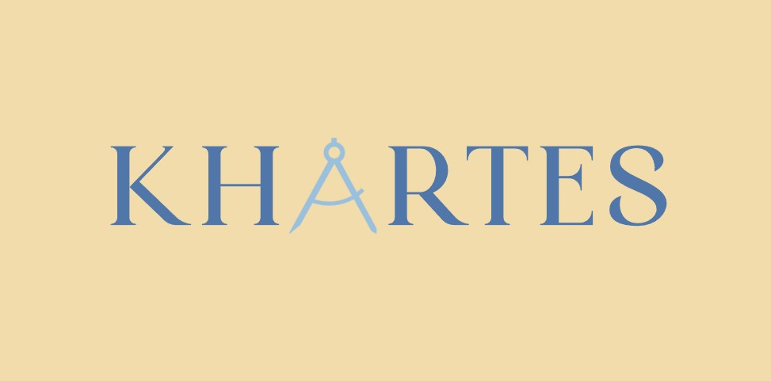
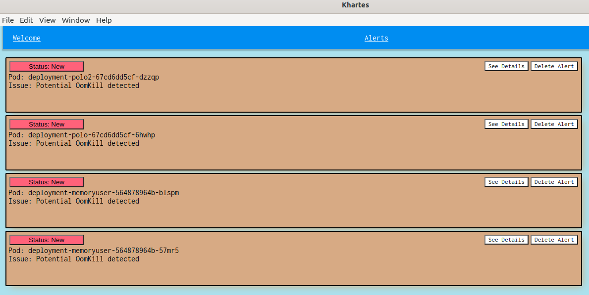
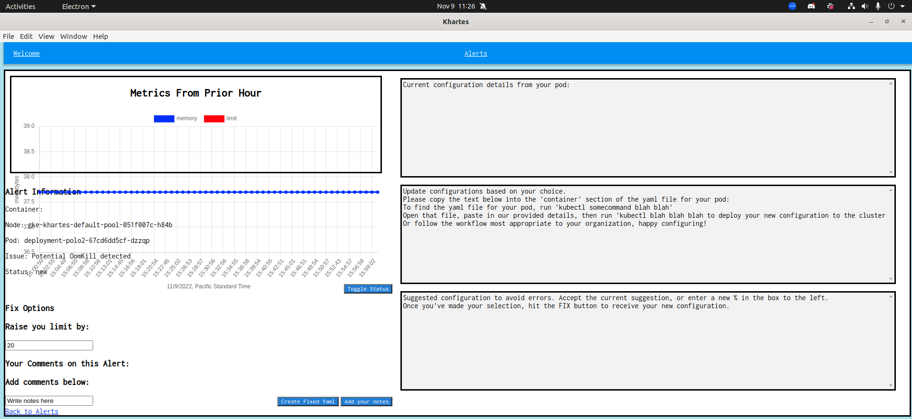

<!--
<p align="center">
  
</p>
-->


# Khartes

- An electron based developer tool for early detection and correction of Kubernetes cluster errors.
- Khartes scans your pods for relevant metrics and creates alerts with pertinant information and suggests increased limits in your YAML deployment files.
- Khartes is greek for "map", and it seems Kubernetes tool names need to start with a K. 

###### Current errors scanned for

- Khartes will scan your pods for memory usage and memory limits for potential OOMKills.

###### Errors in progress

- Khartes will scan your pods for disk space and disk limits for potential Persistant Volume reaching capacity errors. 
- Khartes will scan your YAML files to check for configured limits that allow pods to exceed node limits.
- Kartes will scan your pods for memory and CPU limits that far exceed standard usage, allowing you to dial back limits and potentially save money. 


## Running the Electron App
Prerequisites:
- [ ] kubectl installed on your machine
- [ ] Prometheus installed and working on your cluster
- [ ] Prometheus port-forwarded to "localhost:9090". 

If this is the first time launching the app, please run the following commands:
```
npm install
npm run build
```

This will install needed dependencies and package the files appropriately. You only have to do this on the initial install. 

To run the app, type:
```
npm start
```

## Using Khartes
1. On a successful startup, you will be welcomed with a landing page.  
2. Khartes reads your kubectl context configuration to auto detect your cluster context to watch. 
3. Click "alerts" to see your alerts. Hopefully you don't have any!
  - Khartes checks for known issues every 15 seconds.



4. Click on "See Details" to see metrics from the last hour, YAML details for memory and CPU limits, etc. 



5. If you want to raise the limits, youc an enter a percentage you want them fixed by, then click "Create fixed Yaml" and Khartes will give you a changed YAML section to paste into your deployment YAML. 
 - Most production environments will want deployment YAML files to go through a versioning tool and review process. If you are learning, it's OK to just apply your deployment YAML file. We hope to add functionality to deploy fixes in the future.
6. If you have your YAML file under your DevOps process but not yet deployed, you do not want to see this error pop up again. Click "Toggle Status" and your alert will be "Pending". You can later delete the alert at the Alerts page. 


## The Team
- Kristen Cendana       [Github](https://github.com/kristencendana) [LinkedIn](https://www.linkedin.com/in/kristenabby/)
- Mark Nichting         [Github](https://github.com/omahomie1) [LinkedIn](https://www.linkedin.com/in/mark-nichting/)
- Joseph Heffernan      [Github](https://github.com/interim17) [LinkedIn](https://www.linkedin.com/in/joseph-heffernan/)
- JP Keith              [Github](https://github.com/JPKeith15) [LinkedIn](https://www.linkedin.com/in/jpkeith/)
- Tony Diethelm         [Github](https://github.com/tonydiethelm) [LinkedIn](https://www.linkedin.com/in/tonydiethelm/)


## Built With

- [Electron](https://www.electronjs.org/)
- [TypeScript](https://www.typescriptlang.org/)
- [React](https://reactjs.org/)
- [React Router](https://reactrouter.com/)
- [Node](https://nodejs.org/)
- [Prometheus](https://prometheus.io/)
- [Chart.js](https://www.chartjs.org/)


## More about prerequisites
- Khartes utilizes the kubernetes command line tool (kubectl) to gather data on your nodes and clusters. Kubectl can be downloaded and installed [here](https://kubernetes.io/docs/tasks/tools/).

Further documentation:
- https://cloud.google.com/kubernetes-engine/docs/how-to/cluster-access-for-kubectl
- https://cloud.google.com/sdk/docs/install

- To access Prometheus, we need a port forward on your local machine.
```kubectl --namespace [probably monitoring] port-forward [prometheus-server-name-for-your-cluster] 9090```

- Installing and configuring Prometheus is beyond the scope of this Readme. Sorry!

- Khartes has not yet been tested with Amazon Elastic Kubernetes Service (EKS) or Microsoft Azure Kubernetes Service (AKS), but should be compatible provided that kubectl can access all cluster and node information. Khartes HAS been tested with minikube and Google Kubernetes Engine (GKE).

